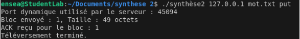

# tp_synthese_2_noterman_slimani
# 1. Utilisation des arguments passés à la ligne de commande des programmes `gettftp` et `puttftp` pour obtenir les informations de requêtes (serveur et fichier)

Dans cette question, nous voulons créer un programme pour s’assurer que le client TFTP interprète correctement les arguments fournis via les commandes. On veut donc récupérer l’adresse du serveur et le nom du fichier qui sont nécessaires pour faire une requête TFTP.

Que ce soit pour `gettftp` et `puttftp`, le code permettant de récupérer ces éléments sera le même.

On va créer deux tableaux pour enregistrer (`host` pour le serveur et `file` pour le fichier) les éléments souhaités. 

L’adresse se trouve dans `argv[1]` et le nom du fichier dans `argv[2]`, et on les copie dans leurs tableaux respectifs avec la fonction C `strcpy`.

# 2. Appel à getaddrinfo pour obtenir l’adresse du serveur ;
Dans cette question, nous voulons utiliser la fonction `getaddrinfo` pour obtenir des informations sur l'adresse du serveur TFTP. Grâce à cela, on va pouvoir établir une communication. Dans le cadre de ce TP, le TFTP utilise le protocole UDP. La fonction `getaddrinfo` est adaptée car elle va nous aider à configurer un socket UDP.

L’utilisation de `getaddrinfo` se trouve dans le `main`. Dans un premier temps, on initialise tout avec la fonction `memset`.

Description du code :
- Puisque l’on veut uniquement utiliser les adresses en IPv4, il faut écrire la ligne de code suivante : `hints.ai_family = AF_INET`. 
- On définit le `socktype` comme étant `SOCK_DGRAM`, soit pour une connexion du type UDP.
- On met le `ai_protocol` à `0` pour que le système prenne le protocole par défaut, soit l’UDP.

Enfin, on vérifie le succès de l’appel de `getaddrinfo` en affichant une erreur dans le cas contraire.

# 3. Réservation d’un socket de connexion vers le serveur.

On va utiliser la fonction `socket` pour créer le nouveau socket. Cette fonction a trois paramètres : 
- Un paramètre pour indiquer la famille d’adresse, ici ce sera IPv4, donc la variable `ai_family` qui est configurée en `AF_INET`.
- Un paramètre pour le type de socket, on veut un socket de type UDP, donc on prend la variable `ai_socktype` qui est configurée en `SOCK_DGRAM`.
- Le dernier paramètre correspond au protocole. On configure avec la variable `ai_protocol` qui vaut `0`.

Cette fonction renvoie :
- Un entier qui représente la description du socket; Cet entier nous permettra d'interagir avec le socket.
- `-1` en cas d’erreur.

## 4. Pour `gettftp` : 
### a) Construction d’une requête en lecture (RRQ) correctement formée, et envoi au serveur

L’objectif de cette question est de construire une requête TFTP de type `RRQ` qui sera envoyée au serveur pour transformer un fichier en mode lecture.

Pour cela, nous créons la fonction `sendRRQ`. En paramètre de cette fonction, on renseigne le descripteur de socket UDP, un pointeur vers l’adresse du serveur et le nom du fichier que le client souhaite lire.

Le buffer contient la requête `RRQ` à envoyer. Les deux premiers éléments du tableau correspondent à l’OPCODE, pour une requête `RRQ`, il faut avoir `buffer[0] = 0` (c’est toujours le cas) et `buffer[1] = 1` (vaut 1 spécialement pour le `RRQ`). On complète le buffer avec le nom du fichier et le mode de transfert.

Avec un `if`, on envoie la requête et on vérifie qu’il n’y a pas d’erreur.

Cette fonction permet donc au client de demander un fichier à un serveur TFTP en envoyant une requête de type `RRQ`.

### b) Réception d’un fichier constitué d’un seul paquet de données (DAT) et son acquittement (ACK)

Dans cette question, on veut implémenter la réception d’un fichier via le protocole TFTP. Le client doit recevoir un paquet de données contenant le fichier (`DAT`) puis, une fois le paquet reçu, envoyer un acquittement (`ACK`) pour informer le serveur que les données ont bien été reçues.

### c) Réception d’un fichier constitué de plusieurs paquets de données (DAT) et leurs acquittements respectifs (ACK)

Dans cette question, on veut réaliser la même opération que dans la question précédente, mais cette fois-ci pour un fichier divisé en plusieurs paquets.

1. **Initialisation** :
   - On initialise les buffers et l’adresse du serveur.

2. **Boucle principale** :
   - On réceptionne les paquets à l’aide de la fonction `recvfrom`, qui reçoit un paquet et le stocke dans le buffer. Si la réception échoue, une erreur s’affiche.
   - Ensuite, il faut analyser le paquet reçu :
     - L’opcode est enregistré dans les deux premiers octets, ce qui permet d’identifier le type de paquet.

3. **Traitement des paquets** :
   - On identifie l’opcode (qui doit valoir `3` pour les paquets de données).
   - Les données sont écrites à partir du 4ᵉ élément du tableau.

## 5) Pour `puttftp` :  

### a) Construction d’une requête en écriture (WRQ) correctement formée, et envoi au serveur

On veut créer et envoyer une requête `WRQ` au serveur pour démarrer un transfert de fichier du client vers le serveur.

On commence donc par faire une requête d’écriture de paquet au serveur.

Cela fonctionne de la même manière que la question précédente, sauf que pour la requête `WRQ` l’opcode vaut `2` (donc `buffer[1] = 2`).

### b) Envoi d’un fichier constitué de plusieurs paquets de données (DAT) et réception de son acquittement (ACK)

On va devoir écrire une fonction pour téléverser des fichiers constitués de plusieurs paquets. 

- On utilise la fonction `fopen` pour ouvrir le fichier.
- On va coder une boucle pour transférer ces différents paquets. Pour cela, nous devons lire les données avec la fonction `fread` qui peut lire jusqu’à 512 octets du fichier. Ces données se trouvent dans le buffer à partir du quatrième élément. On envoie chaque paquet avec `sendto()`.

Pour vérifier que l’envoi s'est bien déroulé, on peut afficher le numéro du bloc et la taille des données envoyées. Comme à la question 4, on envoie un acquittement du serveur au client via la fonction `recvfrom()`.

Enfin, on ferme le fichier à la fin de l’opération.

